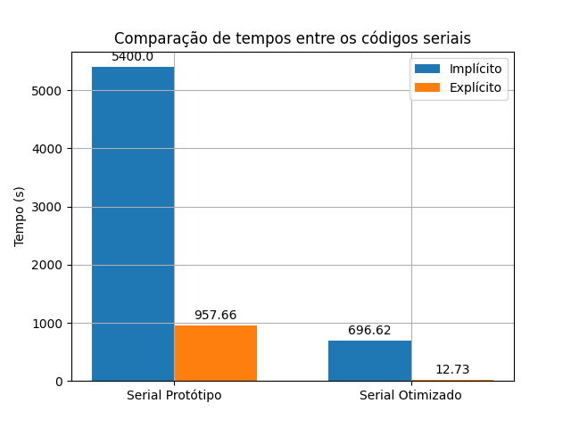
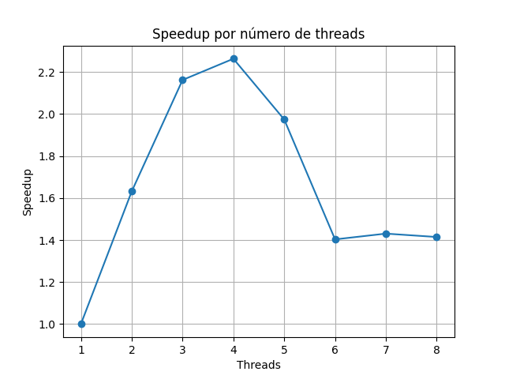

# PCA & HPC: Otimização Arquitetural e Paralelismo em C

Este repositório contém uma implementação do algoritmo de Análise de Componentes Principais (PCA) construída do zero em C. O foco principal do projeto é a exploração de técnicas de Computação de Alto Desempenho (HPC), como localidade de cache (Data Locality) e paralelismo de memória compartilhada (OpenMP), para superar gargalos de *Memory Bound*.

O projeto atinge paridade numérica com a biblioteca Scikit-Learn (Python) e demonstra um *speedup* expressivo ao transitar de um solver SVD Implícito para a Eigendecomposition Explícita da Matriz de Covariância.

📚 **Nota:** Para a demonstração matemática, análise arquitetural detalhada e tabelas de desempenho, consulte o Artigo Técnico disponível em `docs/pca_e_hpc.pdf`.

---

## 📊 Gráficos e Resultados

As evidências visuais do impacto arquitetural, incluindo o colapso do tempo de execução e a curva ideal de *Speedup* e Eficiência do OpenMP (cravando o limite físico da FPU em 4 *threads*), estão armazenadas no diretório `docs/img/`. As especificações do pc estão no arquivo em docs.


### Comparação de Tempos (Implícito vs. Explícito)


### Curva de Speedup (OpenMP)


---

## 📁 Estrutura do Projeto

A arquitetura do repositório segue o padrão de uma *Benchmark Suite* modular:

```text
hpc-pca-portfolio/
├── Makefile                     # Maestro: Makefile raiz para compilar todo o projeto
├── README.md                    # Este arquivo
├── docs/                        # Documentação técnica e assets
│   ├── img/                     # Gráficos de performance (Speedup, Eficiência, Tempos)
│   └── relatorio_tecnico.pdf    # Paper completo com a fundamentação matemática
└── src/                         # Códigos-fonte e scripts de execução
    ├── solver_implicito/        # Método baseado em SVD Unilateral (Memory Bound)
    │   ├── run_benchmark.sh     # Executa o benchmark serial
    │   ├── run_benchmark_omp.sh # Executa o benchmark paralelo
    │   └── ...                  # Arquivos .c, .h e Makefile local
    ├── solver_explicito/        # Método via Matriz de Covariância (Compute Bound)
    │   ├── run_benchmark.sh     # Executa o benchmark serial
    │   ├── run_benchmark_omp.sh # Executa o benchmark paralelo
    │   └── ...                  # Arquivos .c, .h e Makefile local
    └── versao_python/           # Baseline para validação de tempo e corretude
        └── pca.py               # Script usando Scikit-Learn/NumPy
